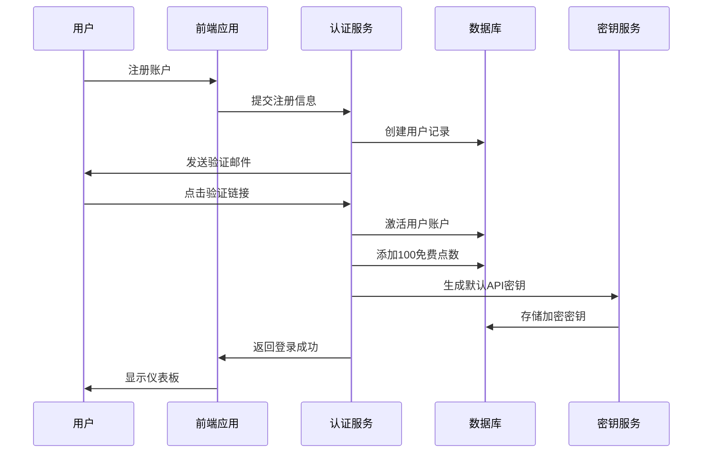
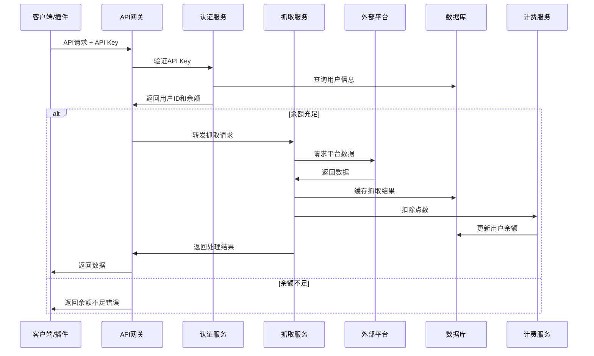
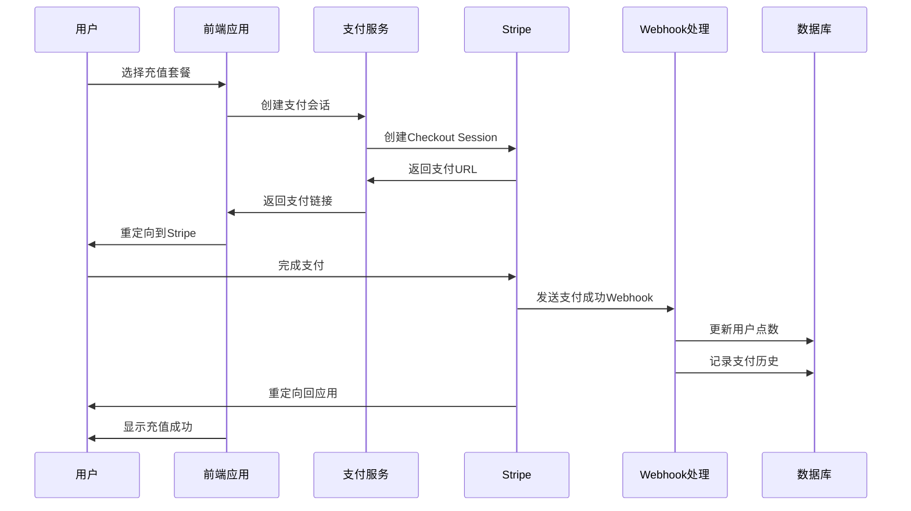

# 飞书多维表格数据抓取SaaS平台 - 产品需求文档

**文档版本**: V1.0  
**创建时间**: 2025-09-04 16:39  
**产品经理**: AI产品设计师  

---

## 📋 产品路线图 (Product Roadmap)

### 🎯 核心目标 (Mission)
为电商和短视频自媒体用户提供一站式的社交媒体数据抓取和分析服务，通过飞书多维表格插件和SaaS平台的结合，实现高效的数据获取和管理工作流。

### 👥 用户画像 (Persona)
**主要用户群体**:
- **电商运营人员**: 需要监控竞品数据、分析市场趋势
- **短视频自媒体创作者**: 需要分析热门内容、优化创作策略
- **数字营销团队**: 需要批量获取社交媒体数据进行分析
- **企业数据分析师**: 需要自动化的数据收集工具

**核心痛点**:
- 手动收集社交媒体数据效率低下
- 缺乏统一的数据管理和分析平台
- 需要技术门槛低的自动化解决方案
- 希望数据能直接导入到工作流中

### 🚀 V1: 最小可行产品 (MVP)

#### 核心功能列表:
1. **用户认证系统**
   - 邮箱注册/登录
   - 用户账户管理
   - 密码重置功能

2. **点数充值系统**
   - 三档充值套餐：50元/5000点数、95元/10000点数、189元/20000点数
   - 支持Stripe支付集成
   - 充值记录和余额显示

3. **API密钥管理**
   - 自动生成唯一API Key
   - 复制和重置API Key功能
   - API使用统计和监控

4. **基础数据抓取API**
   - 支持抖音、小红书链接解析
   - 提取基础信息：标题、作者、播放数、点赞数、评论数
   - 点数消耗计费系统

5. **用户仪表板**
   - 余额和使用情况展示
   - API调用历史记录
   - 账户设置管理

### 🔮 V2 及以后版本 (Future Releases)

#### V2.0 功能规划:
- **扩展平台支持**: 快手、Bilibili、YouTube、TikTok、Instagram
- **高级数据提取**: 视频下载链接、分辨率信息、发布时间
- **批量处理**: 支持批量URL处理
- **数据导出**: CSV、Excel格式导出

#### V3.0 功能规划:
- **飞书多维表格插件集成**: 直接在飞书中使用数据抓取功能
- **数据分析仪表板**: 趋势分析、热门内容推荐
- **API速率限制优化**: 更灵活的调用频率控制
- **团队协作功能**: 多用户共享API额度

#### V4.0 功能规划:
- **AI内容分析**: 自动标签分类、情感分析
- **实时监控**: 关键词监控、竞品追踪
- **高级报表**: 自定义报表生成
- **企业级功能**: SSO登录、权限管理

---

## 📊 关键业务逻辑 (Business Rules)

### 计费规则
- **点数消耗**: 每次API调用消耗1个点数
- **充值套餐**: 
  - 基础套餐：50元 = 5000点数 (0.01元/点)
  - 标准套餐：95元 = 10000点数 (0.0095元/点)
  - 高级套餐：189元 = 20000点数 (0.00945元/点)
- **点数有效期**: 永久有效，不过期
- **退款政策**: 未使用的点数支持7天内退款

### API使用规则
- **速率限制**: 每分钟最多100次调用
- **并发限制**: 每个API Key最多5个并发请求
- **数据缓存**: 相同URL 24小时内返回缓存数据，不重复扣费
- **失败重试**: API调用失败不扣除点数

### 用户权限
- **免费用户**: 注册即送10点数用于测试
- **付费用户**: 享受技术支持和优先处理
- **API Key**: 每个用户最多生成3个有效API Key

---

## 🗄️ 数据契约 (Data Contract)

### 用户数据模型
```typescript
interface User {
  id: string;
  email: string;
  username?: string;
  credits: number; // 点数余额
  totalSpent: number; // 总消费金额
  apiKeys: ApiKey[];
  subscriptionStatus: 'active' | 'inactive';
  createdAt: Date;
  lastLoginAt: Date;
}
```

### API密钥数据模型
```typescript
interface ApiKey {
  id: string;
  userId: string;
  keyValue: string; // 加密存储
  name: string; // 用户自定义名称
  isActive: boolean;
  usageCount: number;
  lastUsedAt: Date;
  createdAt: Date;
}
```

### 数据抓取记录
```typescript
interface DataExtractionRecord {
  id: string;
  userId: string;
  apiKeyId: string;
  platform: 'douyin' | 'xiaohongshu' | 'kuaishou' | 'bilibili';
  sourceUrl: string;
  extractedData: {
    title: string;
    author: string;
    playCount?: number;
    likeCount?: number;
    commentCount?: number;
    shareCount?: number;
    collectCount?: number;
    duration?: string;
    publishTime?: Date;
  };
  creditsUsed: number;
  status: 'success' | 'failed' | 'pending';
  errorMessage?: string;
  createdAt: Date;
}
```

### 充值记录
```typescript
interface PaymentRecord {
  id: string;
  userId: string;
  amount: number; // 充值金额
  credits: number; // 获得点数
  paymentMethod: 'stripe';
  transactionId: string;
  status: 'pending' | 'completed' | 'failed' | 'refunded';
  createdAt: Date;
  completedAt?: Date;
}
```

---

## 🎨 MVP 原型设计

### 设计理念A: 简约专业型
```
┌─────────────────────────────────────────────────────────────┐
│  🏠 DataExtract Pro                    👤 用户名 ▼  📊 仪表板 │
├─────────────────────────────────────────────────────────────┤
│                                                             │
│  💰 当前余额: 8,500 点数                    🔄 充值          │
│  📊 今日使用: 45 次调用                                      │
│                                                             │
│  🔑 API 密钥管理                                            │
│  ┌─────────────────────────────────────────────────────┐   │
│  │ API Key: dk_1a2b3c4d5e6f...              📋 复制    │   │
│  │ 状态: 活跃  │  使用次数: 1,234  │  🔄 重置          │   │
│  └─────────────────────────────────────────────────────┘   │
│                                                             │
│  💳 充值套餐                                                │
│  ┌─────────┐  ┌─────────┐  ┌─────────┐                    │
│  │ 基础版   │  │ 标准版   │  │ 高级版   │                    │
│  │ ¥50     │  │ ¥95     │  │ ¥189    │                    │
│  │ 5K点数   │  │ 10K点数  │  │ 20K点数  │                    │
│  │ [购买]   │  │ [购买]   │  │ [购买]   │                    │
│  └─────────┘  └─────────┘  └─────────┘                    │
│                                                             │
│  📈 使用统计                                                │
│  ┌─────────────────────────────────────────────────────┐   │
│  │ 本月调用: ████████░░ 2,340/5,000                    │   │
│  │ 成功率: 98.5%  │  平均响应: 1.2s                    │   │
│  └─────────────────────────────────────────────────────┘   │
└─────────────────────────────────────────────────────────────┘
```

### 设计理念B: 卡片式布局
```
┌─────────────────────────────────────────────────────────────┐
│ 🎯 DataExtract Hub        🔍 搜索    🔔 通知    👤 个人中心   │
├─────────────────────────────────────────────────────────────┤
│                                                             │
│ ┌─────────────────┐  ┌─────────────────┐  ┌───────────────┐ │
│ │ 💰 账户余额      │  │ 📊 今日统计      │  │ 🚀 快速操作    │ │
│ │                │  │                │  │               │ │
│ │   8,500 点数    │  │   45 次调用     │  │  🔑 生成API   │ │
│ │   ¥85.00 价值   │  │   98% 成功率    │  │  📋 查看文档   │ │
│ │                │  │                │  │  💬 联系支持   │ │
│ │   [💳 充值]     │  │   [📈 详情]     │  │               │ │
│ └─────────────────┘  └─────────────────┘  └───────────────┘ │
│                                                             │
│ ┌─────────────────────────────────────────────────────────┐ │
│ │ 🔑 API 密钥管理                                          │ │
│ │                                                         │ │
│ │ 📱 移动端密钥    dk_mobile_1a2b...    📋 复制  🔄 重置   │ │
│ │ 💻 桌面端密钥    dk_desktop_2c3d...   📋 复制  🔄 重置   │ │
│ │ 🌐 网页端密钥    dk_web_3e4f...       📋 复制  🔄 重置   │ │
│ │                                                         │ │
│ │                                          [➕ 新增密钥]   │ │
│ └─────────────────────────────────────────────────────────┘ │
│                                                             │
│ ┌─────────────────────────────────────────────────────────┐ │
│ │ 💎 充值套餐选择                                          │ │
│ │                                                         │ │
│ │ 🥉 基础版        🥈 标准版        🥇 高级版              │ │
│ │ ¥50 / 5K点数     ¥95 / 10K点数    ¥189 / 20K点数        │ │
│ │ 适合个人用户      最受欢迎         企业推荐              │ │
│ │ [立即购买]       [立即购买]       [立即购买]            │ │
│ └─────────────────────────────────────────────────────────┘ │
└─────────────────────────────────────────────────────────────┘
```

### 设计理念C: 侧边栏导航型
```
┌─────────────────────────────────────────────────────────────┐
│ 📊 DataExtract                                              │
├───────────────┬─────────────────────────────────────────────┤
│ 🏠 仪表板      │  欢迎回来，张三！                            │
│ 💰 充值中心    │                                             │
│ 🔑 API管理     │  ┌─────────────────────────────────────┐     │
│ 📈 使用统计    │  │ 💰 当前余额: 8,500 点数              │     │
│ ⚙️  账户设置   │  │ 📊 本月使用: 2,340 次               │     │
│ 📚 帮助文档    │  │ 🎯 成功率: 98.5%                   │     │
│ 💬 技术支持    │  └─────────────────────────────────────┘     │
│               │                                             │
│               │  🔑 API 密钥                                │
│               │  ┌─────────────────────────────────────┐     │
│               │  │ 主密钥: dk_1a2b3c4d5e6f...          │     │
│               │  │ 创建时间: 2025-01-15                │     │
│               │  │ 使用次数: 1,234                     │     │
│               │  │ 状态: 🟢 活跃                       │     │
│               │  │                                     │     │
│               │  │ [📋 复制密钥] [🔄 重置] [❌ 删除]     │     │
│               │  └─────────────────────────────────────┘     │
│               │                                             │
│               │  💳 快速充值                                │
│               │  ┌─────────┐ ┌─────────┐ ┌─────────┐        │
│               │  │ ¥50     │ │ ¥95     │ │ ¥189    │        │
│               │  │ 5K点数   │ │ 10K点数  │ │ 20K点数  │        │
│               │  │ [购买]   │ │ [购买]   │ │ [购买]   │        │
│               │  └─────────┘ └─────────┘ └─────────┘        │
│               │                                             │
│               │  📊 最近活动                                │
│               │  • 2025-01-24 14:30 - 抖音数据抓取 (成功)   │
│               │  • 2025-01-24 14:25 - 小红书数据抓取 (成功) │
│               │  • 2025-01-24 14:20 - API密钥重置          │
└───────────────┴─────────────────────────────────────────────┘
```

---

## 🏗️ 技术架构蓝图

### 核心流程图

#### 用户注册和API密钥生成流程


#### 数据抓取API调用流程


#### 充值支付流程


### 组件交互说明

#### 需要修改的现有文件:
1. **schema.prisma**: 添加新的数据模型
   - ApiKey模型
   - DataExtractionRecord模型
   - PaymentRecord模型
   - 修改User模型，添加credits字段

2. **main.wasp**: 添加新的路由和操作
   - API管理页面路由
   - 数据抓取API端点
   - 充值相关操作

3. **src/payment/plans.ts**: 修改充值套餐
   - 添加点数充值套餐
   - 移除订阅模式

#### 新增模块:
1. **src/api-management/**: API密钥管理模块
   - ApiKeyPage.tsx: API管理界面
   - operations.ts: API密钥CRUD操作
   - utils.ts: 密钥生成和加密工具

2. **src/data-extraction/**: 数据抓取核心模块
   - extractionService.ts: 抓取服务主逻辑
   - platformAdapters/: 各平台适配器
     - douyinAdapter.ts
     - xiaohongshuAdapter.ts
   - validation.ts: 请求参数验证

3. **src/credits/**: 点数管理模块
   - CreditsPage.tsx: 点数管理界面
   - operations.ts: 点数相关操作
   - billingService.ts: 计费逻辑

4. **src/dashboard/**: 用户仪表板
   - DashboardPage.tsx: 主仪表板
   - StatsWidget.tsx: 统计组件
   - QuickActions.tsx: 快速操作组件

### 技术选型与风险

#### 核心技术栈:
- **前端**: React + TypeScript + TailwindCSS (继承Open SaaS)
- **后端**: Node.js + Wasp Framework + Prisma ORM
- **数据库**: PostgreSQL
- **支付**: Stripe
- **部署**: Fly.io (继承Open SaaS配置)

#### 关键技术选型:
1. **数据抓取引擎**: 
   - 选择Puppeteer + Playwright组合
   - 支持JavaScript渲染和反爬虫绕过
   - 风险: 平台反爬虫策略更新

2. **API限流**: 
   - 使用Redis + express-rate-limit
   - 支持用户级别和全局限流
   - 风险: 高并发下的性能瓶颈

3. **数据缓存**: 
   - Redis缓存抓取结果24小时
   - 减少重复请求和成本
   - 风险: 缓存一致性问题

4. **API密钥安全**: 
   - 使用bcrypt加密存储
   - JWT token验证机制
   - 风险: 密钥泄露和滥用

#### 潜在技术风险:
1. **平台反爬虫**: 目标平台可能更新反爬虫策略
   - 缓解: 多种抓取策略，定期更新适配器

2. **性能瓶颈**: 大量并发抓取请求
   - 缓解: 队列系统，分布式部署

3. **数据合规**: 抓取数据的法律合规性
   - 缓解: 仅抓取公开数据，添加使用条款

4. **成本控制**: 云服务和第三方API成本
   - 缓解: 智能缓存，成本监控告警

---

## 📝 开发优先级建议

### 第一阶段 (2-3周):
1. 修改用户模型，添加点数系统
2. 实现API密钥管理功能
3. 修改支付系统为点数充值模式
4. 创建基础的用户仪表板

### 第二阶段 (3-4周):
1. 开发数据抓取核心引擎
2. 实现抖音和小红书适配器
3. 添加API端点和认证中间件
4. 实现计费和限流系统

### 第三阶段 (2-3周):
1. 完善用户界面和体验
2. 添加使用统计和监控
3. 实现错误处理和日志系统
4. 进行全面测试和优化

### 第四阶段 (1-2周):
1. 部署和上线准备
2. 文档编写和API文档
3. 用户反馈收集和迭代
4. 为V2版本做准备

---

**文档状态**: ✅ 已完成  
**下一步**: 等待用户确认原型设计选择，然后开始技术实现

---

*本文档将作为项目开发的核心指导文件，所有功能开发都应严格按照此文档执行。*